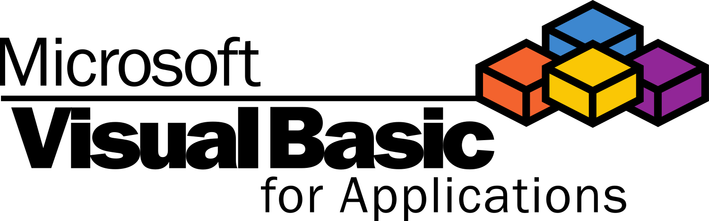
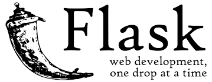
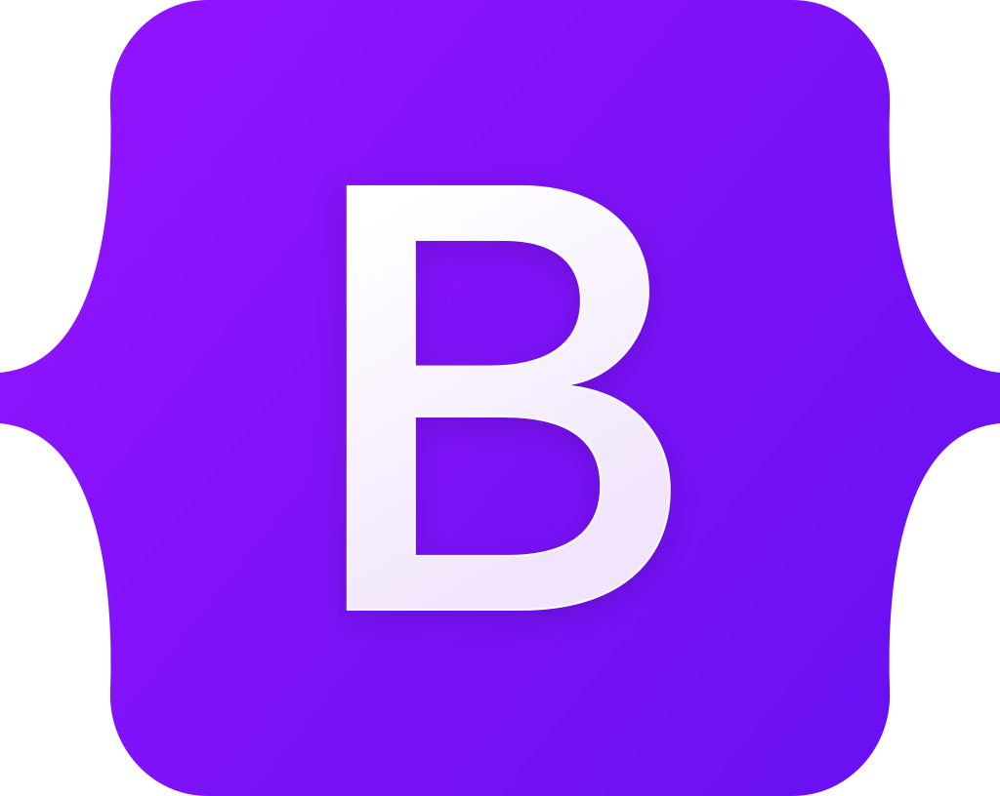

## About me

- Currently studying CS at HHU in Düsseldorf, Germany
- Working Student in NLP/language consulting

 

## Languages & Frameworks I've worked with

#### Programming/Markup/Style Sheet/Query Languages

|               |             |              |               |                |                      |                     |                  |                                                  |            |                               |
|:--------------------------------------------:|:----------------------------------------:|:------------------------------------------:|:-----------------------------------------:|:-------------------------------------------:|:--------------------------------------------------:|:-----------------------------------------------:|:------------------------------------------:|:----------------------------------------------------------------------------:|:--------------------------------------:|:-------------------------------------------------------:|
| <a href="https://www.python.org/">Python</a> | <a href="https://www.java.com/">Java</a> | <a href="https://www.mysql.com/">MySQL</a> | <a href="https://www.w3.org/XML/">XML</a> | <a href="https://www.w3.org/html/">HTML</a> | <a href="https://www.latex-project.org/">LaTeX</a> | <a href="https://www.w3.org/Style/CSS/">CSS</a> | <a href="https://www.r-project.org/">R</a> | <a href="https://learn.microsoft.com/en-us/office/vba/api/overview/">VBA</a> | <a href="https://www.php.net/">PHP</a> | <a href="https://www.iso.org/standard/74528.html">C</a> |

#### NLP Frameworks

|                 |         |                         |              |                      |
|:---------------------------------------------------:|:-------------------------------------:|:-----------------------------------------------------:|:-----------------------------------------:|:----------------------------------------------------------------:|
| <a href="https://huggingface.co/">Hugging Face</a>  | <a href="https://spacy.io/">SpaCy</a> | <a href="https://github.com/flairNLP/flair">Flair</a> | <a href="https://www.nltk.org/">NLTK</a>  | <a href="https://simpletransformers.ai/">Simple Transformers</a> |

#### Computer Vision Frameworks

|                 |                              |                               |                               |
|:---------------------------------------------------:|:---------------------------------------------------------------:|:------------------------------------------------------------:|:------------------------------------------------------------:|
| <a href="https://huggingface.co/">Hugging Face</a>  | <a href="https://github.com/qanastek/HugsVision">HugsVision</a> | <a href="https://python-pillow.org/">Pillow</a> | <a href="https://github.com/opencv/opencv-python">OpenCV</a> |

#### Other Tools and Libraries

|                  |                |               |             |                          |                 |
|:-----------------------------------------------:|:---------------------------------------------------:|:------------------------------------------------:|:---------------------------------------------:|:------------------------------------------------------:|:-------------------------------------------------:|
| <a href="https://pandas.pydata.org/">pandas</a> | <a href="https://scikit-learn.org">scikit-learn</a> | <a href="https://matplotlib.org/">Matplotlib</a> | <a href="https://streamlit.io/">Streamlit</a> | <a href="https://flask.palletsprojects.com/">Flask</a> | <a href="https://getbootstrap.com/">Bootstrap</a> |
