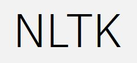

### About me

- Currently studying CS at HHU in Düsseldorf, Germany
- Working Student in NLP/language consulting

### Programming/Markup/Style Sheet/Query Languages

|  |  |  |   |  | |  |  |  |
|:---:|:---:|:---:|:---:|:---:|:---:|:---:|:---:|:---:|
|  |  |  |  |  |  |  |  |  |

### NLP Frameworks

|  |  |  |  |  |
|:---:|:---:|:---:|:---:|:---:|
| <a href="https://huggingface.co/">Hugging Face</a> | <a href="https://github.com/flairNLP/flair">Flair</a> | <a href="https://simpletransformers.ai/">simpletransformers</a> | <a href="https://spacy.io/">SpaCy</a> | <a href="https://www.nltk.org/">NLTK</a> |

### Computer Vision Frameworks

|  |  |
|:---:|:---:|
| <a href="https://huggingface.co/">Hugging Face</a> | <a href="https://github.com/qanastek/HugsVision">HugsVision</a> |
